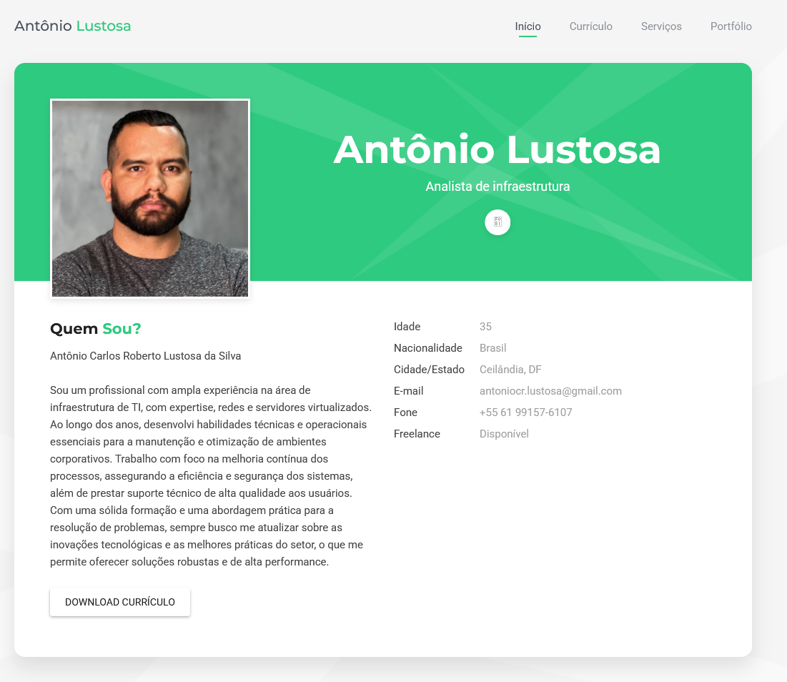

# Nome do seu projeto
> Um resumo curto sobre o que o seu projeto faz

Um ou doi parágrafos sobre seu projeto e o que ele faz.



## Instalação

OS X & Linus:

```sh
npm install --save
```

Windows:

```sh
edit autoexec.bat
```

## Exemplo de uso

Alguns exemplos que motivariam as pessoas a utilizarem seu projeto ou que demonstrasse que este é útil para alguma coisa. Divida esta parte em partes menores e se possível coloque algum código ou prints de telas.


## Ambiente de Desenvolvimento

Descrever como instalar e preparar qualquer dependência de desenvolvimento para que seu projeto possa ser executado localmente e pessoas possam contribuir com o mesmo. Se possível fornecça as informações para diferentes plataformas, exemplo Windows, Linux e Mac OS.

## Histórico de Atualizações

* 0.2.1
    *CHANGE: atualização dos docs (o código não foi alterado)
* 0.2.0
    * CHANGE: Removida a função
    `setPadrãoXYZ()`
    * ADD: Adicionando a função `inicializar()`
* 0.1.1
    * FIX: Crash quando executava `escrever()` (Obrigado por @Cotribuidor)
* 0.1.0
    * O primeiro lançamento estável
    * CHANGE: Renomeado de `Projeto XYZ` para `Projeto ABC`
0.0.1
    *Projeto inicial

## Meta
Seu nome - [@SeuTwitter](https://twitter.com/seuTwitter) - seuemail@gmail.com

Distribuído sobre a licença. Veja `LICENÇA` para mais informações.

[https://github.com/seuusuaurio/seuprojeto](https://github.com/seusuario)